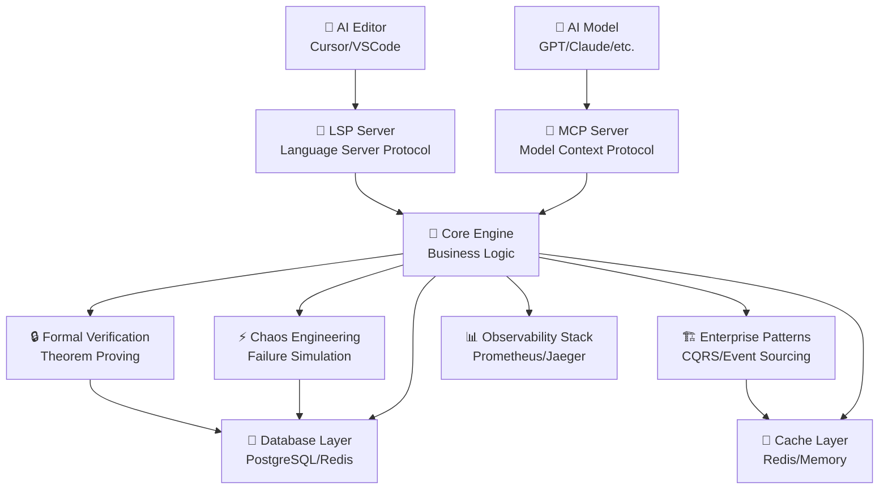

# Architecture Overview

```mermaid
graph TB
    %% Input Layer
    AI_Editor["🤖 AI Editor<br/>Cursor/VSCode"]
    AI_Model["🧠 AI Model<br/>GPT/Claude/etc."]

    %% Interface Layer
    LSP["🔌 LSP Server<br/>Language Server Protocol"]
    MCP["🔌 MCP Server<br/>Model Context Protocol"]

    %% Enterprise Layer
    Core["🎯 Core Engine<br/>Business Logic"]
    Verification["🔒 Formal Verification<br/>Theorem Proving"]
    Chaos["⚡ Chaos Engineering<br/>Failure Simulation"]
    Patterns["🏗️ Enterprise Patterns<br/>CQRS/Event Sourcing"]

    %% Infrastructure Layer
    Observability["📊 Observability Stack<br/>Prometheus/Jaeger"]
    Database["💾 Database Layer<br/>PostgreSQL/Redis"]
    Cache["🚀 Cache Layer<br/>Redis/Memory"]

    %% Data Flow
    AI_Editor --> LSP
    AI_Model --> MCP
    LSP --> Core
    MCP --> Core
    Core --> Verification
    Core --> Chaos
    Core --> Patterns
    Verification --> Database
    Chaos --> Database
    Patterns --> Cache
    Core --> Observability
    Core --> Database
    Core --> Cache
```
