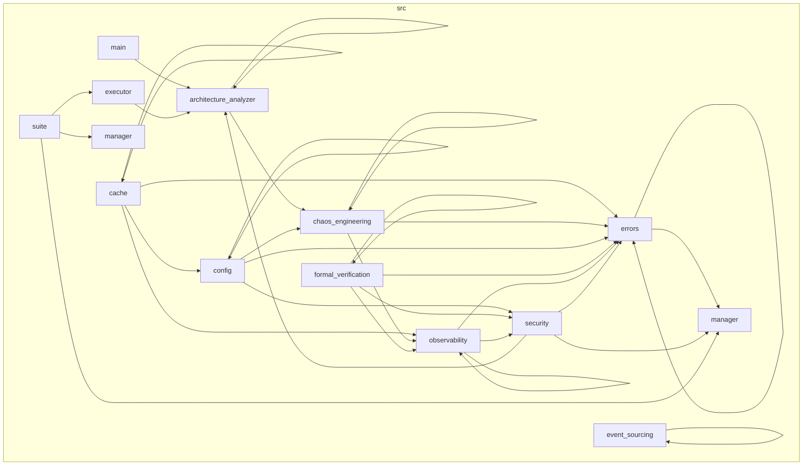

# Module Dependencies

```mermaid
graph TD
    subgraph src
        src_aiagentsuite_cli_main[main]
        src_aiagentsuite_core_architecture_analyzer[architecture_analyzer]
        src_aiagentsuite_core_cache[cache]
        src_aiagentsuite_core_chaos_engineering[chaos_engineering]
        src_aiagentsuite_core_config[config]
        src_aiagentsuite_core_errors[errors]
        src_aiagentsuite_core_event_sourcing[event_sourcing]
        src_aiagentsuite_core_formal_verification[formal_verification]
        src_aiagentsuite_core_observability[observability]
        src_aiagentsuite_core_security[security]
        src_aiagentsuite_core_suite[suite]
        src_aiagentsuite_framework_manager[manager]
        src_aiagentsuite_memory_bank_manager[manager]
        src_aiagentsuite_protocols_executor[executor]
    end

    src_aiagentsuite_cli_main --> src_aiagentsuite_core_architecture_analyzer
    src_aiagentsuite_core_architecture_analyzer --> src_aiagentsuite_core_architecture_analyzer
    src_aiagentsuite_core_architecture_analyzer --> src_aiagentsuite_core_chaos_engineering
    src_aiagentsuite_core_cache --> src_aiagentsuite_core_cache
    src_aiagentsuite_core_cache --> src_aiagentsuite_core_observability
    src_aiagentsuite_core_cache --> src_aiagentsuite_core_errors
    src_aiagentsuite_core_cache --> src_aiagentsuite_core_config
    src_aiagentsuite_core_chaos_engineering --> src_aiagentsuite_core_chaos_engineering
    src_aiagentsuite_core_chaos_engineering --> src_aiagentsuite_core_observability
    src_aiagentsuite_core_chaos_engineering --> src_aiagentsuite_core_errors
    src_aiagentsuite_core_config --> src_aiagentsuite_core_chaos_engineering
    src_aiagentsuite_core_config --> src_aiagentsuite_core_security
    src_aiagentsuite_core_config --> src_aiagentsuite_core_errors
    src_aiagentsuite_core_config --> src_aiagentsuite_core_config
    src_aiagentsuite_core_errors --> src_aiagentsuite_core_errors
    src_aiagentsuite_core_errors --> src_aiagentsuite_memory_bank_manager
    src_aiagentsuite_core_event_sourcing --> src_aiagentsuite_core_event_sourcing
    src_aiagentsuite_core_formal_verification --> src_aiagentsuite_core_formal_verification
    src_aiagentsuite_core_formal_verification --> src_aiagentsuite_core_security
    src_aiagentsuite_core_formal_verification --> src_aiagentsuite_core_observability
    src_aiagentsuite_core_formal_verification --> src_aiagentsuite_core_errors
    src_aiagentsuite_core_observability --> src_aiagentsuite_core_security
    src_aiagentsuite_core_observability --> src_aiagentsuite_core_observability
    src_aiagentsuite_core_observability --> src_aiagentsuite_core_errors
    src_aiagentsuite_core_security --> src_aiagentsuite_core_architecture_analyzer
    src_aiagentsuite_core_security --> src_aiagentsuite_core_errors
    src_aiagentsuite_core_security --> src_aiagentsuite_memory_bank_manager
    src_aiagentsuite_core_suite --> src_aiagentsuite_framework_manager
    src_aiagentsuite_core_suite --> src_aiagentsuite_protocols_executor
    src_aiagentsuite_core_suite --> src_aiagentsuite_memory_bank_manager
    src_aiagentsuite_protocols_executor --> src_aiagentsuite_core_architecture_analyzer
```
